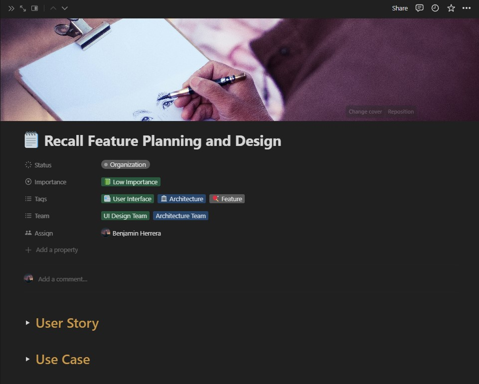
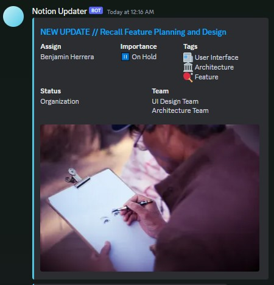
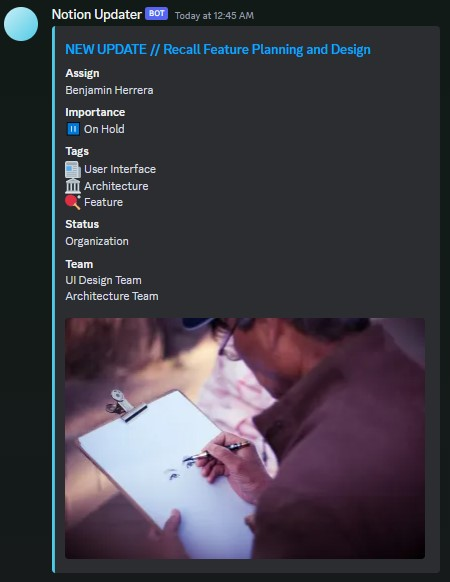

# Notion2Discord (N2D)
### Made with 💖 by Benjamin Herrera
N2D is a simple to use script that sends messages to a Discord channel for every
new update to the items in your Notion database!

## Preview
What it looks like on Notion



What it looks like on Discord



What it looks like on Discord with vertically stacked attributes



## Dependencies
1. Any Linux Distribution
2. Docker (if not using in-house python packages)
3. Miniconda (if not using Docker)

## Setup Guide
This is going to be tedious, but bare with me! 😉👍
1. Git clone this repo
```bash
git clone https://github.com/BenjaminHerrera/Notion2Discord.git
```
2. Create a `.env` file in the `./` directory. It should have the following contents:
```bash
NOTION_INTEGRATION_TOKEN="..."
NOTION_DATABASE_ID="..."
DISCORD_WEBHOOK_URL="..."
```
3. Go to [your Notion integration page](https://www.notion.so/my-integrations) >>
`New Integration` >> Enter name for integration >> `Submit` >> Copy `Internal Integration Secret` >> Paste it as a value for the `NOTION_INTEGRATION_TOKEN` variable in
your `.env` file.
5. Go to your database on Notion >> Click on the three dots on the top right
of the page >> `Add connections` >> Select integration that you made.
7. Copy the database's link and extract the substring `<hash_1>` from this format:
```
https://www.notion.so/<hash_1>?v=<hash_2>
```
8. Place this substring as a value for the `NOTION_DATABASE_ID` variable in your
`.env` file.
9. Click on the gear icon next discord channel name >> `Integrations` >> `Webhooks` >> `New Webhook` >> Click on new webhook >> `Copy Webhook URL` >> Paste the URL into the value section of the `DISCORD_WEBHOOK_URL` variable in your `.env` file.
13. Hard parts done! Now that you have your `.env` created, check the [Run Guide](https://github.com/BenjaminHerrera/Notion2Discord#run-guide) on how to
run the project.

## Run Guide

### If you want to use `DOCKER` _(preferred)_

1. `docker compose up -d --build`

### If you want to use `PYTHON` with `CRONTAB` and `MINICONDA`

1. `./install_crontab.sh`

### If you want to use `PYTHON` with no repeat

1. `cd notion2discord`
2. `pip install -r requirements.txt`
3. `python main.py`

## Configuration Documentation
Configuration for the application can be found in `./notion2discord/config/config.json`

- `logo` : _string_ - Image URL to customize your webhook sender
- `name` : _string_ - Name of the webhook sender
- `color` : _int_ - Color of the embed messages. Use [this](https://www.spycolor.com/) to find _decimal value_ representation of your preferred color.
- `inline_attributes` : _boolean_ - True to have everything fill from left to right. False if you want them to be in a straight column
- `datetime_format_with_time` : _string_ - Time formatter for dates with times. This is used for date attributes in Notion DB items with time specified. Use [this](https://www.w3schools.com/python/python_datetime.asp) to help you create your desired format string
- `datetime_format_without_time` : _string_ - Time formatter for dates without times. This is used for date attributes in Notion DB items with NO time specified. Use [this](https://www.w3schools.com/python/python_datetime.asp) to help you create your desired format string.
- `dispatch_limit` : _int or None_ - Limit how much can be dispatched to your Discord text channel.
- `empty_value` : _string_ - Standard format for values that are empty
- `checkbox_true` : _string or Emoji_ - Value to show if checkboxes are filled
- `checkbox_false` : _string or Emoji_ - Value to show if checkboxes are NOT filled
- `debug_mode` : _boolean_ - Either turn on or turn off debugging outputs
- `last_update_offset` : _int_ - Sometimes, timings can be finicky. Accounts for lag from Notion and your server's end. Use this value to get items that have been edited 60 seconds plus `last_update_offset` seconds amount of time.
